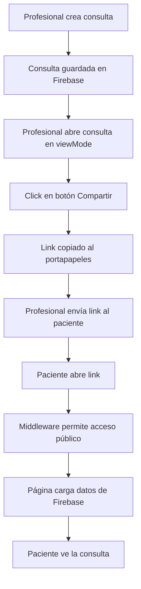

# 🔗 Sistema de Compartir Consultas

## Descripción

Sistema para compartir consultas médicas y deportivas mediante un enlace público que no requiere autenticación. Permite a los profesionales compartir fácilmente los registros de consultas con pacientes y otros profesionales.s

## 📁 Archivos Implementadosaa
aa
### 1. Página Pública de Consulta
**Archivo:** `/src/pages/compartir/consulta/[consultaId].js`

Página pública que muestra la información completa de una consulta sin necesidad de autenticación.

**Características:**
- ✅ No requiere login
- ✅ Diseño limpio y profesional
- ✅ Muestra todos los datos relevantes de la consulta
- ✅ Soporta consultas normales y deportivas
- ✅ Responsive (móvil y desktop)
- ✅ Información del cliente
- ✅ Branding de Science in Motion

**Secciones mostradas:**
- Datos personales del paciente
- Motivo de consulta
- Antecedentes médicos
- Signos vitales (para atletas)
- Medidas antropométricas
- Objetivos
- Diagnóstico y plan de tratamiento
- Observaciones

### 2. Middleware Actualizado
**Archivo:** `/src/middleware.js`

Configuración de rutas públicas para permitir acceso sin autenticación.

**Cambios:**
```javascript
// Rutas de compartir que no requieren autenticación
const isShareRoute = pathname.startsWith('/compartir/');

// Permitir acceso a rutas de compartir sin autenticación
if (isShareRoute) {
  return NextResponse.next();
}
```

### 3. Botón de Compartir en Consultas
**Archivos modificados:**
- `/src/pages/usuarios/[id]/citas/index.js` (Consultas normales)
- `/src/pages/usuarios/[id]/citas-deportivas/index.js` (Consultas deportivas)

**Funcionalidad:**
- Botón "Compartir" visible solo en modo de lectura (viewMode)
- Copia automáticamente el link al portapapeles
- Toast de confirmación al copiar
- Fallback con alert si no se puede copiar

## 🚀 Uso

### Para Profesionales (Dentro del sistema)

1. **Ver una consulta existente:**
   - Navega al historial del cliente
   - Abre la consulta que deseas compartir
   - La consulta se abrirá en modo de solo lectura

2. **Compartir la consulta:**
   - Click en el botón "Compartir" (icono Share2)
   - El link se copia automáticamente al portapapeles
   - Mensaje de confirmación: "Link copiado al portapapeles ✅"
   - Comparte el link por WhatsApp, email, etc.

### Para Pacientes/Receptores (Fuera del sistema)

1. **Abrir el link compartido:**
   - Reciben un link como: `https://tudominio.com/compartir/consulta/consulta_id_123`
   - No requiere login ni contraseña
   - Se muestra toda la información en modo lectura

2. **Visualizar información:**
   - Header con branding de Science in Motion
   - Información del paciente
   - Todos los detalles de la consulta
   - Diseño profesional y fácil de leer

## 🔐 Seguridad

### Consideraciones Implementadas

✅ **Links únicos:** Cada consulta tiene un ID único no predecible
✅ **Solo lectura:** Los links públicos no permiten modificar datos
✅ **Sin datos sensibles en URL:** Solo se pasa el ID de la consulta
✅ **Firebase Security Rules:** Se recomienda configurar reglas adicionales

### Recomendaciones Adicionales

⚠️ **Importante:** Considera implementar:

1. **Expiración de links:**
   - Agregar campo `shareExpiration` a las consultas
   - Verificar fecha de expiración antes de mostrar
   - Ejemplo: Links válidos por 30 días

2. **Tokens de acceso:**
   - Generar token único al compartir
   - Almacenar token en la consulta
   - Validar token en la URL: `/compartir/consulta/[id]?token=xyz`

3. **Firebase Security Rules:**
```javascript
// Permitir lectura pública solo de consultas específicas
match /consultas/{consultaId} {
  allow read: if true; // O agregar validación de token
}
```

4. **Rate Limiting:**
   - Implementar límite de intentos por IP
   - Prevenir scraping masivo

5. **Audit Log:**
   - Registrar accesos a consultas compartidas
   - Timestamp y metadatos del acceso

## 🎨 Personalización

### Modificar el diseño de la página compartida

Edita `/src/pages/compartir/consulta/[consultaId].js`:

```javascript
// Cambiar colores del header
<div className="bg-gradient-to-r from-teal-600 to-teal-500">
  // Cambia a tus colores
</div>

// Agregar/quitar secciones
{renderSection('Nueva Sección', <>{/* contenido */}</>, <Icon />)}

// Modificar footer
<div className="bg-white rounded-xl shadow-sm border border-gray-200 p-6">
  // Tu branding aquí
</div>
```

### Agregar campos adicionales

En la función `renderSection`, agrega nuevos campos:

```javascript
{renderField('Nuevo Campo', consulta.nuevoCampo)}
```

## 📱 Responsive

El diseño es completamente responsive:

- **Móvil:** Layout de una columna, texto legible
- **Tablet:** Optimización de espacios
- **Desktop:** Máximo ancho de 5xl (80rem)

## 🧪 Testing

### Probar la funcionalidad

1. **Crear una consulta de prueba:**
```bash
# En la app, crear y finalizar una consulta
```

2. **Obtener el ID:**
```bash
# Ver en Firebase Console o en la URL al ver la consulta
```

3. **Probar el link público:**
```bash
# Abrir en modo incógnito:
http://localhost:3000/compartir/consulta/[ID_CONSULTA]
```

4. **Verificar que no requiere auth:**
```bash
# Debe mostrar la consulta sin pedir login
```

## 🐛 Troubleshooting

### El link no funciona

1. **Verificar middleware:**
   - Revisa que `isShareRoute` detecte `/compartir/`
   - Verifica los logs en consola

2. **Consulta no encontrada:**
   - Confirma que el ID existe en Firebase
   - Revisa los permisos de lectura en Firestore

3. **Redirect al login:**
   - Asegúrate que el middleware permite `/compartir/*`
   - Limpia cookies y prueba en incógnito

### El botón no aparece

- El botón solo aparece en modo `viewMode=true`
- Debe existir un `consultaId` o `draftId`
- Verifica que importaste el icono `Share2`

## 📊 Estructura de Datos

### Consulta en Firestore

```javascript
{
  id: "consulta_normal_clientId_timestamp",
  clienteId: "cliente_id_123",
  type: "normal" | "atleta",
  status: "completed",
  createdAt: Timestamp,
  updatedAt: Timestamp,
  answers: {
    // Todos los campos del formulario
    nombres: "Juan",
    edad: "30",
    // ...
  }
}
```

## 🔄 Flujo Completo



## 🆕 Futuras Mejoras

- [ ] Agregar QR code para compartir
- [ ] Opción de exportar a PDF
- [ ] Modo de impresión optimizado
- [ ] Sistema de notificaciones al compartir
- [ ] Analytics de accesos a links compartidos
- [ ] Opción de revocar acceso (desactivar link)
- [ ] Compartir secciones específicas en lugar de todo
- [ ] Multi-idioma (español/inglés)

## 📝 Notas

- Los links son permanentes mientras exista la consulta en Firebase
- No hay límite de accesos por defecto
- La información mostrada es la misma que ven los profesionales
- Se recomienda no compartir información ultra sensible sin medidas adicionales

---

**Última actualización:** Noviembre 2025
**Autor:** Science in Motion Dev Team
